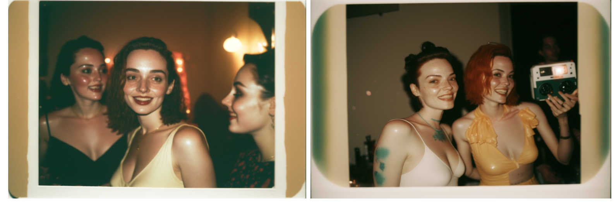
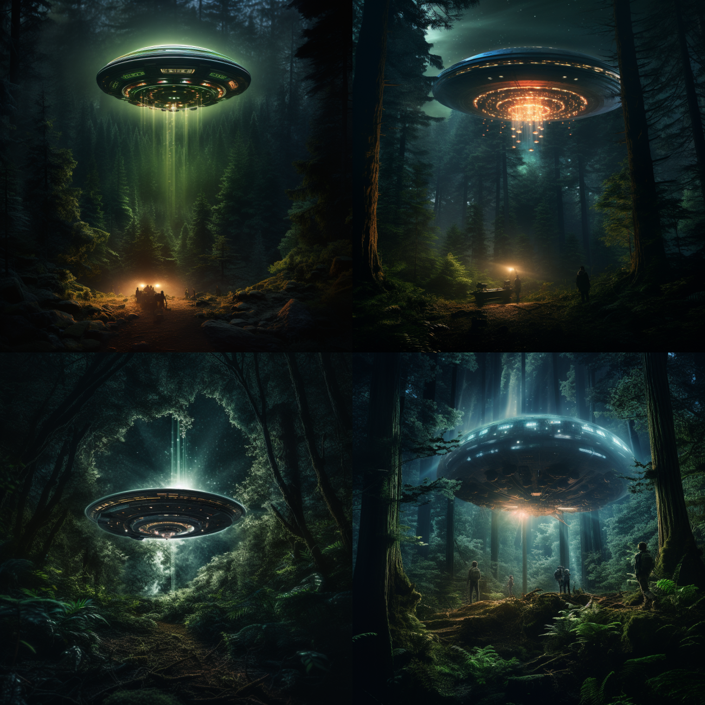
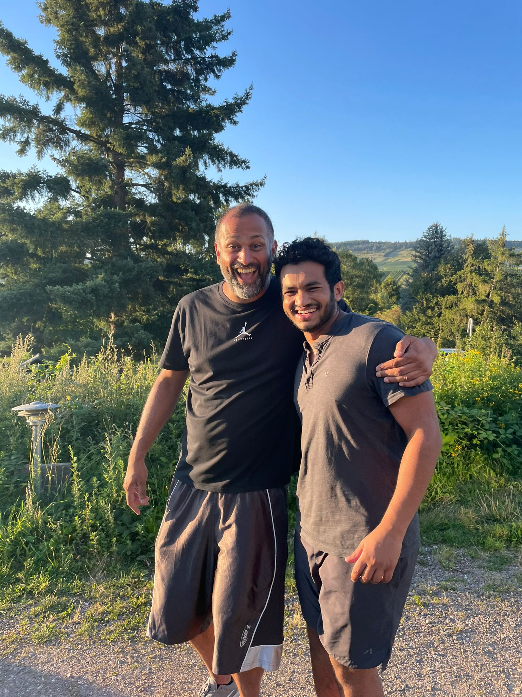

# ReadMe

My goal for this project is to leverage my machine learning experience and create a DeepFake Detection AI system. I was thinking a lot about the field of Digital Forensics and what would be some of the biggest challenges in the upcoming years. I kept coming back to the conclusion that AI development is moving very rapidly and that development is going to swiftly encroach itself in Digital Forensics. For example, Midjourney, an AI Generative Art company has seemingly pushed the bounds of reality by creating photorealistic fake photos. There are almost at the point where you can’t tell if the images were taken in real life or were created by these AI systems.


*Figure 1: These are not real photos. These are created by the AI company Mid Journey. From user @mileszim*

## Files
- detector.ipynb: This is the jupyter notebook where the model is trained
- predict.ipynb: This is the jupyter notebook where the model is used to predict whether an image is a deepfake or not
- my_images: This is a folder of images I created to test the model (photos I took and photos I created with Midjourney)
- readme_main.png: This is the image I used for the readme
- readme.md: This is the readme file
- recording: This is the recording of my presentation
- weights: This is the folder where the weights of the model are stored and model itself
- data: This is the folder where the dataset is stored
  - test 
  - train

tree > file_structure.txt: This is the file structure of the project

## Scope 
AI Generated Content

- Images (yes)

- Video (no)

- Text (no)

- Sound (no)


# Training Model
The jupyter script detector.ipynb is where the training of the model is done.
```
python3 detector.ipynb
```
The model is trained on the dataset created on Kaggle. 

# Running the Image Detection Model
The jupyter script predict.ipynb is where the image detection is done.
```
python3 predict.ipynb
```
We use the model we had previously trained on the detector.ipynb. We then use the model to predict whether the image is a deepfake or not. I created my own dataset of images to test the model. The dataset is located in the folder my_unages. The images are a mix of real and fake images I took or created. The model is able to detect the fake images with a high degree of accuracy. I used Midjourney to create the fake images.

*Figure 2: This image I created with Midjourney with the prompt "Starship landing in Amazon Rainforest*

*Figure 3: Image that was taken of me that was definetly not ai generated*


## Video Presentation
Link to recording of my presentation: https://youtu.be/eBz0ecB39Zk

# Conclusion
- It is possible to detect AI generated images
    - But the pace for AI generation > detection
- Detection for this reason will not be a long-term solution in
regards to Digital Forensics
- Long Term Solution is for AI Image Generation Companies (Midjourney) to create watermarks ingrained